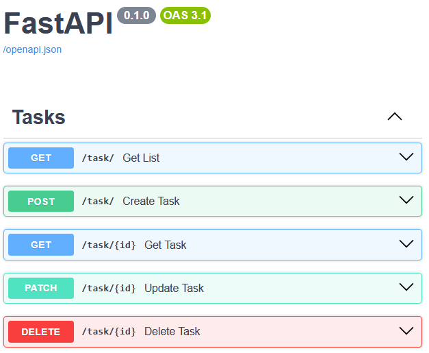

# Содержание:

- [Задание](#задание)
- [Реализация](#реализация)
- [Как можно улучшить](#как-можно-улучшить)
- [Запуск программы](#запуск-программы)
- [Источники](#источники)

# Задание
#### Сервис менеджера задач

CRUD операции для управления задачами (create, get, get_list, update, delete), где модель задачи состоит из uuid, названия, описания, статусов: создано, в работе, завершено.

Технические требования:
- Backend фреймворк:
  1. FastAPI - 3 балла
  2. Flask - 2 балла
  3. Django - 1 балл
- Тестовый фреймворк:
  1. Gauge - 3 балла
  2. pytest - 2 балла
  3. unittest - 1 балл
- PEP8 и принципы чистого кода.
- Внимание уделяется качеству и покрытию тестов.

Дополнительно (по желанию):
- Swagger-документация
- Docker
- README.md с инструкцией

Примечание: Для всех компонентов, где не указаны конкретные требования, разработчик волен выбирать инструменты самостоятельно. Рекомендуется использовать возможности для демонстрации своих навыков и знаний.

# Реализация


Технический стек проекта:
 - FastAPI
 - Dishka
 - SQLAlchemy (PostgreSQL)
 - Docker
 - Alembic

### Как можно улучшить
Для реализации данного проекта я попробовал применить "упрощенную" версию гексагональной архитектуры. Для полной реализации такого паттерна, в данном проекте необходимо разделить понятия Entity и Value Object на более явное разделение. Как и паттерн Repository, для управления хранением и извлечением этих объектов, отделяя доменную логику от конкретной реализации. 

Например, создать класс Entity, который описывает уникальные объекты предметной области. Такой объект имеет постоянную идентичность (id), и два экземпляра считаются равными, если у них одинаковый идентификатор.
```python

@dataclass(eq=False)
class Entity(Generic[T], ABC):
    id: T

    def __setattr__(self, name: str, value: Any) -> None:
        if name == "id" and getattr(self, "id", None) is not None:
            raise DomainError("Changing entity ID is not permitted.")
        super().__setattr__(name, value)

    def __eq__(self, other: Any) -> bool:
        return type(self) is type(other) and other.id == self.id

    def __hash__(self) -> int:
        return hash((type(self), self.id))
```

И Value Object который определяется только набором своих свойств, но не имеет уникального идентификатора. Два Value Object считаются равными, если совпадают все их свойства.
```python

@dataclass(frozen=True, repr=False)
class ValueObject(ABC):
    def __post_init__(self) -> None:
        if not fields(self):
            raise DomainFieldError(
                f"{type(self).__name__} must have at least one field!",
            )

    def __repr__(self) -> str:
        values = ", ".join(f"{k}={v!r}" for k, v in asdict(self).items())
        return f"{type(self).__name__}({values})"

    def get_fields(self) -> dict[str, Any]:
        return asdict(self)
```


# Запуск программы
#### виртуальное окружение
```bash
uv venv .venv
source .venv/bin/activate
uv pip install -r requirements.txt
```

#### Настройка среды
```bash
cp .env.dist .env
docker compose up -d
export $(grep -v '^#' .env | xargs)
```

#### Инициализировать базу данных
```bash
alembic upgrade head
```


#### Запустить проект
```bash
cd src/
uvicorn app.main:app --reload
```


# Источники
Ниже приведены примеры работ и статьи, на которые я опирался при реализации проекта.

- [FastAPI Clean Example](https://github.com/ivan-borovets/fastapi-clean-example)
- [Delivery Service](https://github.com/AKHQProduction/delivery_service)
- [Pure Architecture FastAPI](https://github.com/Maclovi/pure-architecture-fastapi)
- [User Service](https://github.com/SamWarden/user_service)
- [Litestar Dishka Faststream](https://github.com/Sehat1137/litestar-dishka-faststream)
- [Habr: Архитектура и подходы](https://habr.com/ru/companies/pt/articles/820171/)
- [Explicit Architecture – DDD, Hexagonal, Onion, Clean, CQRS](https://herbertograca.com/2017/11/16/explicit-architecture-01-ddd-hexagonal-onion-clean-cqrs-how-i-put-it-all-together/#application-core-organisation)
